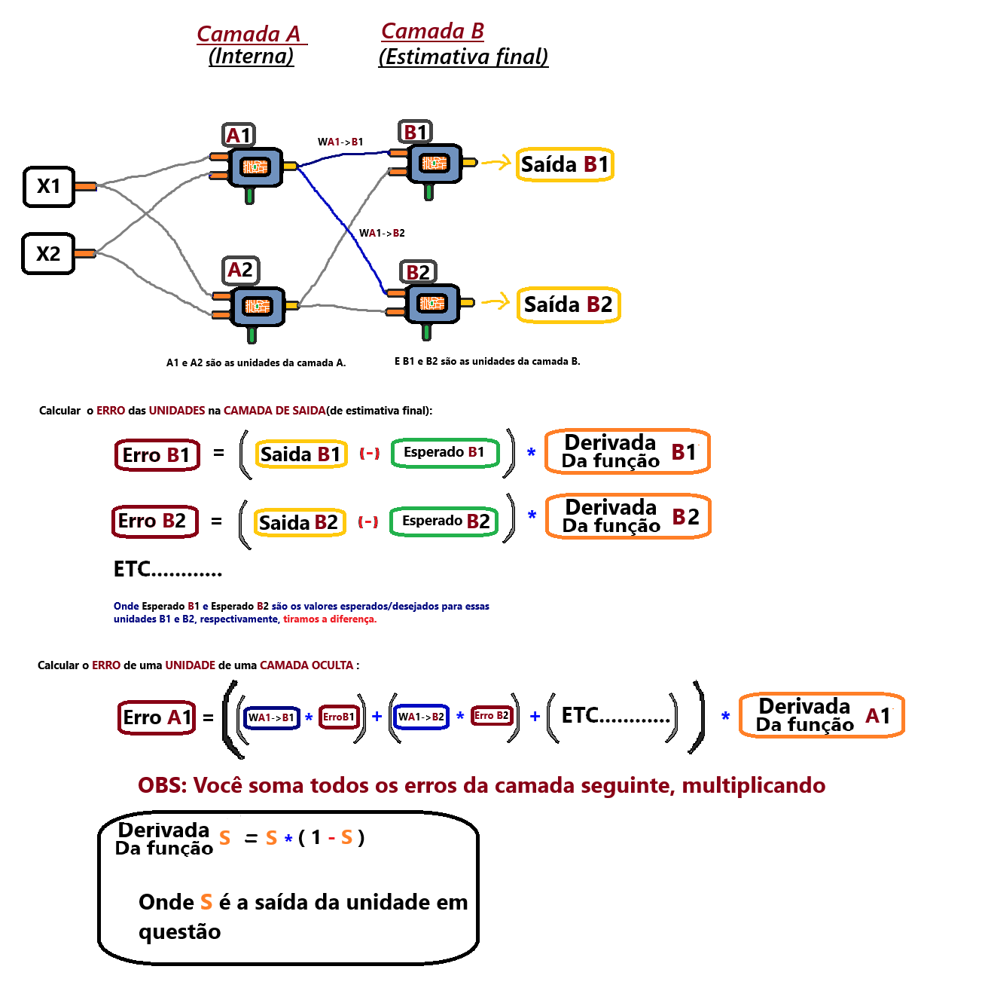

# Como se calcula os gradientes das unidades usando o backpropagation

Esta imagem foi criada como parte do meu aprendizado sobre algoritmos de propagação direta e Backpropagation em redes neurais. Ela reflete meu entendimento pessoal.

Nela mostra o processo fundamental do Backpropagation: **Para se calcular o gradiente de uma unidade que está na camada oculta, nós vamos precisar somar os gradientes de todas as unidades da camada seguinte multiplicados pelo peso que faz essa conexão entre a unidade em questão na camada oculta e a unidade atual da camada seguinte.** Em outras palavras, esse calculo que fazemos é um processo repetitivo e muito simples, que se resume em: Para cada unidade na camada seguinte, some o gradiente dessa unidade(isso é, a unidade da camada seguinte) em questão multiplicado pelo peso(do vetor de pesos) dessa unidade(isso é, a unidade da camada seguinte) em questão cujo indice é O NÙMERO DA UNIDADE ATUAL DA CAMADA OCULTA, ou seja, o peso de número <NÙMERO_DA_UNIDADE_ATUAL>. Esse peso é usado porque esse é o peso(do vetor de pesos) da unidade da camada seguinte, [peso este] que multiplica a saida da unidade em questão da camada oculta, que é usado na etapa de Feedforward. Ou seja, as unidades da camada seguinte na etapa de Feedforward fazem uso desses pesos para propagar os valores para frente, conforme descrito, e fazem isso multiplicando a saida das unidades da camada anterior por seu respectivo peso que é responsável por criar esse eloh, e então, no Backpropagation nós fazemos o caminho reverso/contrário. Ou seja, para calcular o gradiente de uma determinada unidade na camada oculta, vamos ter que usar os gradientes e também os pesos **de todas** as unidades da camada seguinte, isso por que os gradientes das unidades da camada oculta atual dependem dos gradientes das unidades da camada seguinte, e também depdendem dos pesos da camada seguinte, conforme explicado aqui nesse texto, e também ilustrado na imagem. 

Então esse processo é um somatório, e **se resume em: "GRADIENTE * PESO (+) GRADIENTE * PESO (+) ETC...."**, eu coloquei "ETC...." por que essa soma continuaria até que chegasse na ultima unidade da camada seguinte. Reforçando esse ponto, que para calcular o gradiente de uma unidade na camada oculta atual estamos somando os gradientes das unidades da camada seguinte(ou seja, a camada que está a frente da camada oculta atual). E aqui usei o termo "camada oculta atual" por que esse processo é sempre o mesmo para toda e qualquer camada oculta, sempre da mesma forma, ou seja, sempre usando os gradientes da camada seguinte, e também os pesos, conforme ilustrado na imagem, e muito bem descrito aqui. É muito facil de memorizar mentalmente esse fluxo de operações!

# Outra explicação mais resumida:
**Explicação simplificada sobre Backpropagation:**

O processo de backpropagation é uma técnica usada para treinar redes neurais. Para calcular o gradiente de uma unidade em uma camada oculta, precisamos usar os gradientes das unidades na camada seguinte, multiplicados pelos pesos que conectam essas unidades.

Em termos simples, o cálculo do gradiente em uma unidade da camada oculta funciona da seguinte forma: 
 - 1. Pegamos o gradiente de cada unidade da camada seguinte.
 - 2. Multiplicamos esse gradiente pelo peso que conecta essa unidade à unidade atual da camada oculta.
 - 3. Somamos todos esses valores para obter o gradiente total da unidade na camada oculta.

Esse processo é repetido para todas as unidades na camada oculta. Em outras palavras, para calcular o gradiente de uma unidade na camada oculta, somamos os gradientes das unidades na camada seguinte, multiplicados pelos respectivos pesos.

Esse processo é o oposto da propagação para frente (Feedforward), onde os valores são propagados para frente usando os pesos. No backpropagation, fazemos o caminho reverso, ajustando os pesos de acordo com o erro.

A ideia principal é que o gradiente de uma unidade na camada oculta depende dos gradientes e pesos das unidades na camada seguinte. Esse é o fluxo repetitivo do backpropagation, simples de entender uma vez que você compreenda a relação entre as camadas e os pesos.